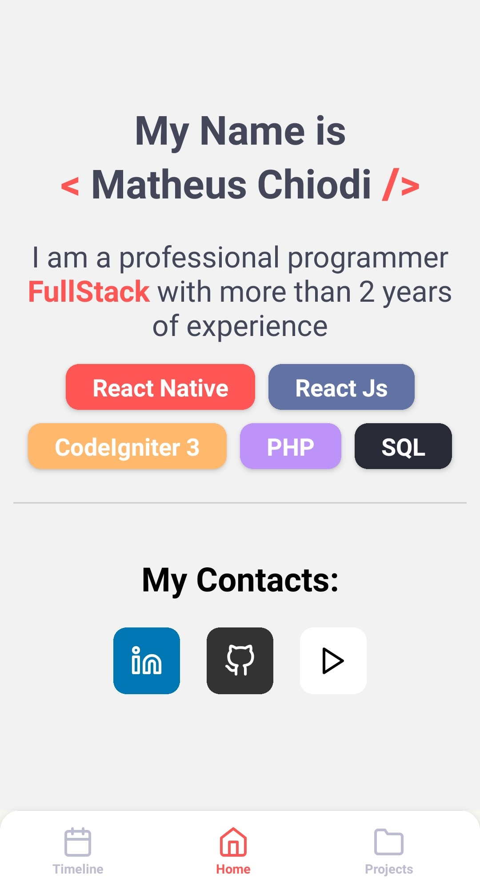
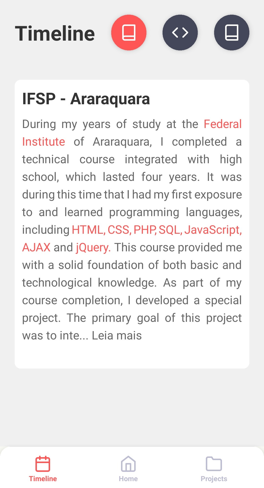
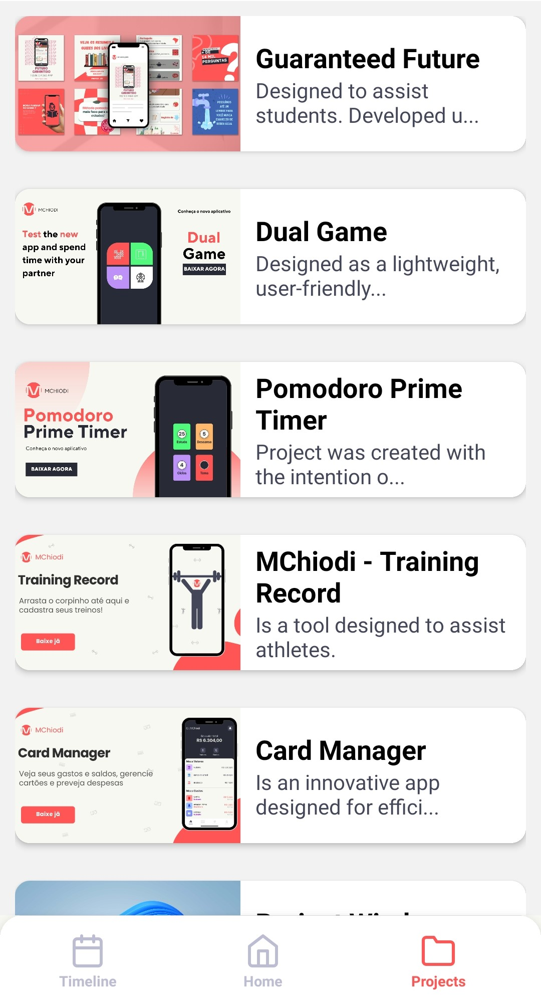

# Desafio do Programa Formação React Native Developer

## Introdução

Este projeto é o resultado das habilidades e conhecimentos adquiridos durante o programa "Formação React Native Developer". Projetado para demonstrar a aplicação prática do React Native no desenvolvimento de aplicações móveis, este projeto abrange três telas principais: Home, Timeline e Projects.

## Telas

### Home
A tela Home é o portal de entrada do aplicativo, proporcionando aos usuários um ponto de partida intuitivo. A partir daqui, os usuários podem navegar com facilidade pelas diversas funcionalidades oferecidas.

### Timeline
A tela Timeline oferece uma visão cronológica de eventos e marcos importantes. É projetada para dar aos usuários uma perspectiva histórica de seus dados.

### Projects
Os projetos são o coração deste aplicativo. Esta tela exibe todos os projetos de maneira limpa e organizada, permitindo que os usuários naveguem e gerenciem seu trabalho de forma eficaz.

## Funcionalidades

- **Design Modular**: Cada tela foi criada com uma abordagem focada no usuário, garantindo uma experiência fluida e coesa.
- **Navegação Intuitiva**: A navegação entre as telas é rápida e natural, aproveitando as capacidades nativas do React Native.
- **Estética Agradável**: O design visual é limpo e moderno, proporcionando uma interface amigável que destaca os projetos do usuário.

## Desenvolvimento

Este projeto foi desenvolvido como parte do desafio do programa "Formação React Native Developer". Ele conta com três telas principais que demonstram a competência técnica e a criatividade aplicada no processo de desenvolvimento.
